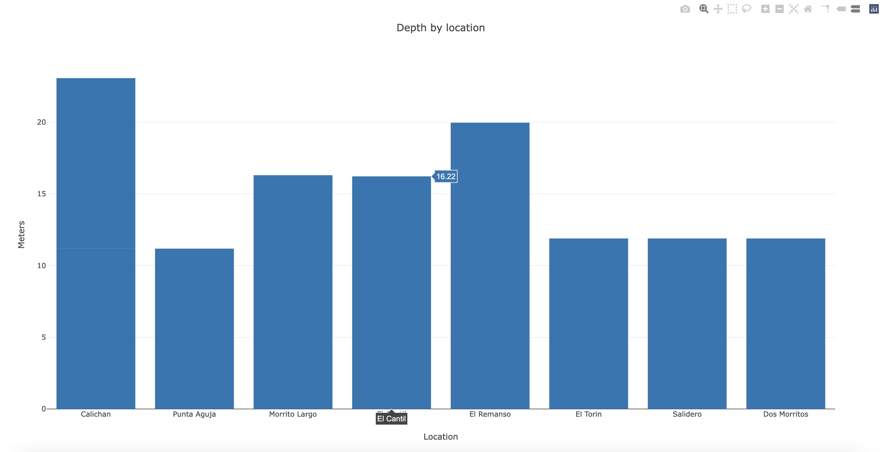

# Open Water

***

Open Water is a set of tools to process data dives.

It is my toy repo to learn Rust.

***

## Current status

Currently, Open Water only is a CLI that processes the dive logs to converts them to JSON and Plots the data. 

#### Limitations

* CLI only supports JSON and a basic plot (average depth by location)
* Since I do not have access to every single computer dive, I do not know how the logs are per vendor. So I'm mocking the data in a CSV file which is the entry-data point.

## Future implementations and roadmap

| Feature | Status | Objective |
| -------- | ------- | -------
| CLI | Implemented | Learn how to write CLI applications
| API and database | Pending | Save data into DB and learn how to write API's
| Desktop GUI | Pending | Learn how to work with graphics and CPU optimization
| Integrate libdivecomputer library | Pending | Learn how to use C libraries into Rust

## How to use

### Library
`make run-lib`

### CLI

###### JSON:

`cargo run --bin cli -- -o json -i /path_to_dive_log.csv`

It prints the JSON in the stdout.

###### PLOT:

`cargo run --bin cli -- -o plot -i /path_to_dive_log.csv`

It draws a bar chat in your browser. e.g:

## Testing

`cargo test`

## License

MIT

## Contributing

This is an open space to learn together Rust and expand our knowledge in the diving world. If you are a diver (our you are interested in the wonderful world) and want to learn or already know Rust. Please feel free to submit a PR or open an issue.
